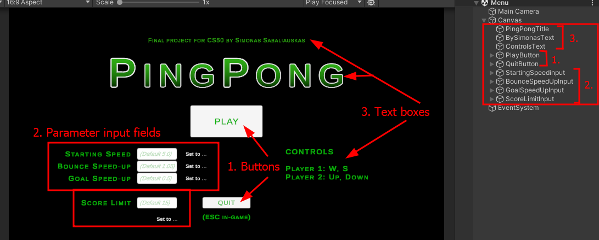
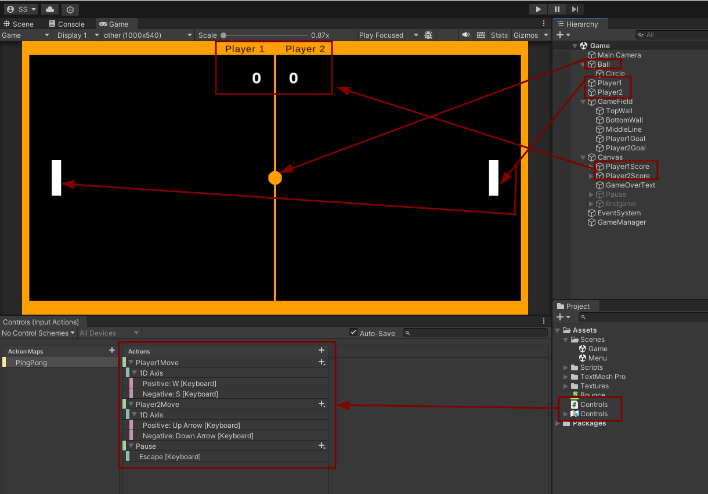
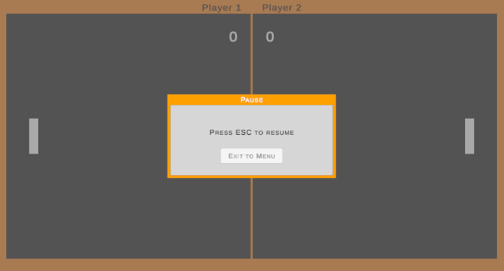
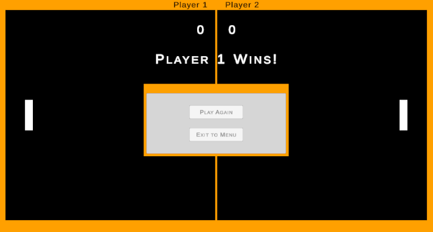

# Ping Pong
## Video Demo:  <https://youtu.be/z-WlF9kfKZs>

## DESCRIPTION

### Intro
This is a 2D game made using Unity and C#.
To play, extract the archive pingPong.7z, and run pingPong.exe. This build is currently set for Windows.

First, I will describe the game from the Unity interface perspective. After that I will briefly explain the C# script files.

It was made with the help of various resources online: Youtube tutorials, StackOverflow, Unity Forum, StackExchange and other places.
I learned a lot making this game, especially when trying the New Unity Input System, which was a bit of a challenge.

### C# Script Structure
The script files are thoroughly commented, and their use is mentioned with the game objects in __General Design__.

#### Scripts used in scene _Menu_: MenuManager.cs, GameSettings.cs and MenuGameSettings.cs.
*   MenuManager.cs hosts StartGame() and QuitGame() to do what the names imply upon buttons being clicked on the screen.
*   MenuGameSettings.cs validates input received from the user, returns alert messages and passes calls GameSettings.cs to set the parameters.
*   GameSettings.cs gets verified user-provided parameter values from MenuGameSettings.cs and sets them in PlayerPrefs.

#### Scripts used in scene _Game_: Ball.cs, GameManager.cs, Goal.cs, Paddle.cs.
*   Ball.cs controls the ball position and speed.
*   Goal.cs waits for either goal to collide with the Ball and calls Player1Scored() or Player2Scored().
*   Paddle.cs gets user input via OnPlayer1Move() and OnPlayer2Move() to move the paddles. It also triggers Ball.SpeedIncreaseAfterBounce().
*   GameManager.cs controls the progress of _Game_ - starting, pausing, quitting, scoring, resetting ball and paddles.

### General Design
There are 2 scenes in this game: __Menu__ and __Game__. Both scenes can direct to another with the help of buttons.

#### __Scene 1 - Menu__
__Menu__ is composed of _EventSystem_ and _Canvas_.
EventSystem handles events and User input via the _Input System UI Input Module_.
__Canvas__ is the object that has all objects that the user can see and interact with.

Menu's functions are materialised in the __Canvas__ game object. All C# scripts are linked to the Canvas, and the children call methods from Canvas.

1. Buttons change color when hovered over and when clicked.
*   __PlayButton__ calls StartGame() from MenuManager.cs to open the second scene (Game).
*   __QuitButton__ calls QuitGame() from MenuManager.cs to exit the program.

2. Input fields have additional text boxes for identification, for placeholder text and for alerts (left side).
*   The four input fields call methods StartingSpeed(), BounceSpeedUp(), GoalSpeedUp() and ScoreLimit() from MenuGameSettings.cs
*   Alert dynamic text changes after the user provides a value.
    If the value is within the set bounds, text appears "Value set to ...".
    If the value is incorrect, text appears "Provide value ..." to help the user provide correct data.

3. Text boxes are direct children of Canvas, or children of buttons/input fields, that supplement these objects with information for the user.

#### __Scene 2 - Game__
__Game__ is composed of _Ball_, Paddles (_Player1_ and _Player2_), _GameField_, _Canvas_, _EventSystem_ and _GameManager_.

##### Ball
It has a simple circle texture, a Rigidbody2D and Circle collider 2D. It is marked by label "Ball".

##### Paddles (Player1 and Player2)
They are simple rectangles that increase in length after goals are scored, until a certain threshold.
Vertical movement is controlled for Player1 by W and S, for Player2 by Up Arrow and Down Arrow.
These game objects have Player Input modules attached to pass user input as messages to Paddle.cs.

When a paddle touches the ball, the method OnCollisionEnter2D() from Paddle.cs calls SpeedIncreaseAfterBounce() from Ball.cs.
This increases the ball speed by the user-specified multiplier (1.05 increases ball speed by 5%, for example).

##### GameField
This game object is a folder for the boundary elements of the "arena" or the "table" of the pong match. The names are quite self-explanatory.
*   _TopWall_ and _BottomWall_ serve simply as walls for the ball to bounce off of.
*   _MiddleLine_ is a graphic element to mark the middle of the GameField, it does not interact with anything.
*   _Player1Goal_ and _Player2Goal_ are collision triggers.
    They trigger OnTriggerEnter2D() from Paddle.cs, which calls Player1Scored() and Player2Scored() from GameManager.cs.

##### Canvas
In this scene, Canvas contains _Player1Score_, _Player2Score_, _GameOverText_, _Pause_ and _Endgame_.
*   _Player1Score_ and _Player2Score_ display which side Player 1 and 2 are on, and their score.
    These objects get the players' scores from Player1Scored() and Player2Scored() from GameManager.cs.
*   _GameOverText_ displays which player won, after the Score Limit has been reached, via GameOver() Gamemanager.cs.
*   _Pause_ box can be called with the press of Escape via TogglePause() method in GameManager.cs and has several visual layers. The parent Pause creates a grey background across all scene.
    PauseBox is the bright orange outer rectangle, PauseBox2 is the grey rectangle on top. This box has a button that can open scene _Menu_ when clicked.
    
*   _Endgame_ box is called via GameOver() in GameManager.cs. It is a folder for the outer box EndgameBox and inner box EndgameBox2 which has 2 buttons.
    "Play Again" calls StartGame(), "Exit to Menu" calls ExitToMenu(), from GameManager.cs.
    
*   _EventSystem_ handles events and User input via the _Input System UI Input Module_.
*   _GameManager_ is a controlling game object.
    Its component Player Input passes an event to TogglePause() when Escape is pressed.
    Also attached is the main controlling script for Game - GameManager.cs.
